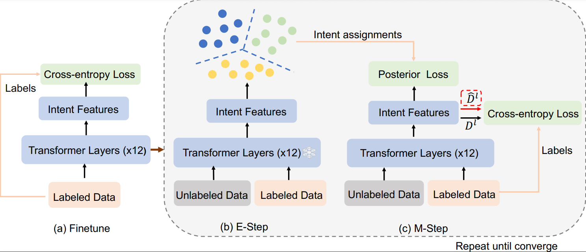

# A Probabilistic Framework for Discovering New Intents

## Introduction
This repository provides the official PyTorch implementation of the research paper 'A Probabilistic Framework for Discovering New Intents'
### Dependencies 

We use anaconda to create python environment:
```
conda create --name python=3.9
```
Install all required libraries:
```
pip install -r requirements.txt
```

## Model Preparation
Get the pre-trained [BERT](https://storage.googleapis.com/bert_models/2018_10_18/uncased_L-12_H-768_A-12.zip) model and convert it into [Pytorch](https://huggingface.co/transformers/converting_tensorflow_models.html). 

Set the path of the uncased-bert model (parameter "bert_model" in init_parameter.py).

## Usage
Run the experiments by: 
```
bash run.sh
```
To compare with MTP, please add the parameter --load_mtp and move the checkpoint to the path.


We use the MTP pretrain checkpoint https://github.com/fanolabs/NID_ACLARR2022. It gives pretrain ckpt in step1 , we further pretrain the checkpoint using its step2 method.
## Model
The model architecture of Our method:




## Thanks && Acknowledgments
Our code implementation is on the basis of https://github.com/thuiar/DeepAligned-Clustering


